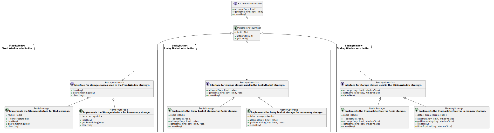

# PHP Rate Limiter

[](https://github.com/twinh/rate-limiter/actions)
[](https://coveralls.io/r/twinh/rate-limiter)
[](http://www.opensource.org/licenses/MIT)

A flexible and scalable Rate Limiter, supporting various common strategies and storage methods.

## Getting started

```php
use RateLimiter\FixedWindow;
use RateLimiter\FixedWindow\MemoryStorage;

$limiter = new FixedWindow(new MemoryStorage(), windowSize: 10, limit: 1);
if (!$limiter->attempt('user_id')) {
    echo 'Too many requests';
}
```

## Feature

- ✨ Supports multiple strategies: `FixedWindow`, `SlidingWindow`, `LeakyBucket`, and `TokenBucket` (not yet).
- 🖥️ Compatible with `Redis`, `Memory`, and `Database` (not yet) storage methods.
- 💪 Robust and scalable architecture with **atomic** operations for high traffic and large user bases.
- ⚙️ Flexible rate limit and window size configuration.
- 🚪 Clear API for attempting, getting remaining attempts, and clearing rate limits.
- 🌐 Supports global, and user-specific rate limits.

## Install

```bash
composer require twinh/rate-limiter
```

## Document

### Initialize the FixedWindow Rate Limiter

```php
use RateLimiter\FixedWindow;
use RateLimiter\FixedWindow\MemoryStorage;

$limiter = new FixedWindow(new MemoryStorage(), windowSize: 60, limit: 1);
```

### Initialize the SlidingWindow Rate Limiter

```php
use RateLimiter\SlidingWindow;
use RateLimiter\SlidingWindow\MemoryStorage;

$limiter = new SlidingWindow(new MemoryStorage(), windowSize: 60, limit: 1);
```

### Initialize the LeakyBucket Rate Limiter

```php
use RateLimiter\LeakyBucket;
use RateLimiter\LeakyBucket\MemoryStorage;

$limiter = new LeakyBucket(new LeakyMemoryStorage(), rate: 10, limit: 1);
```

### Set Redis Storage

```php
use RateLimiter\FixedWindow;
use RateLimiter\FixedWindow\RedisStorage;

$redis = new Redis();
$redis->connect('127.0.0.1', 6379);

$limiter = new FixedWindow(new RedisStorage($redis), windowSize: 10, limit: 1);
```

### Attempts to execute a rate limited operation

```php
if (!$limiter->attempt('user_id')) {
    echo 'Too many requests';
}
```

### Attempts to execute a rate limited operation with global scope

```php
$limiter->attempt();
```

### Attempts to execute a rate limited operation with client IP

```php
$limiter->attempt($_SERVER['REMOTE_ADDR'] ?? 'unknown');
```

### Attempts to execute a rate limited operation with server IP

```php
$limiter->attempt($_SERVER['SERVER_ADDR'] ?? 'unknown');
```

### Get the remaining attempts

```php
$remaining = $limiter->getRemaining('user_id');
```

### Clear the request limit

```php
$limiter->clear('user_id');
```

## Extend more storages and rate limiters

### Add Storage

1. Create a new class that implements the `RateLimiter\Xxx\StorageInterface` interface of the rate limiter.
2. Implement the methods of the storage class.
3. Create the rate limiter object with the new storage object.

### Add Rate Limiter

1. Create a new class that implements the `RateLimiter\RateLimiterInterface`.
2. Implement the methods of the rate limiter class.
3. Create a `StorageInterface` for the rate limiter class.
4. Implement storage object.

## Class Diagram

[](docs/class-diagram.svg)
